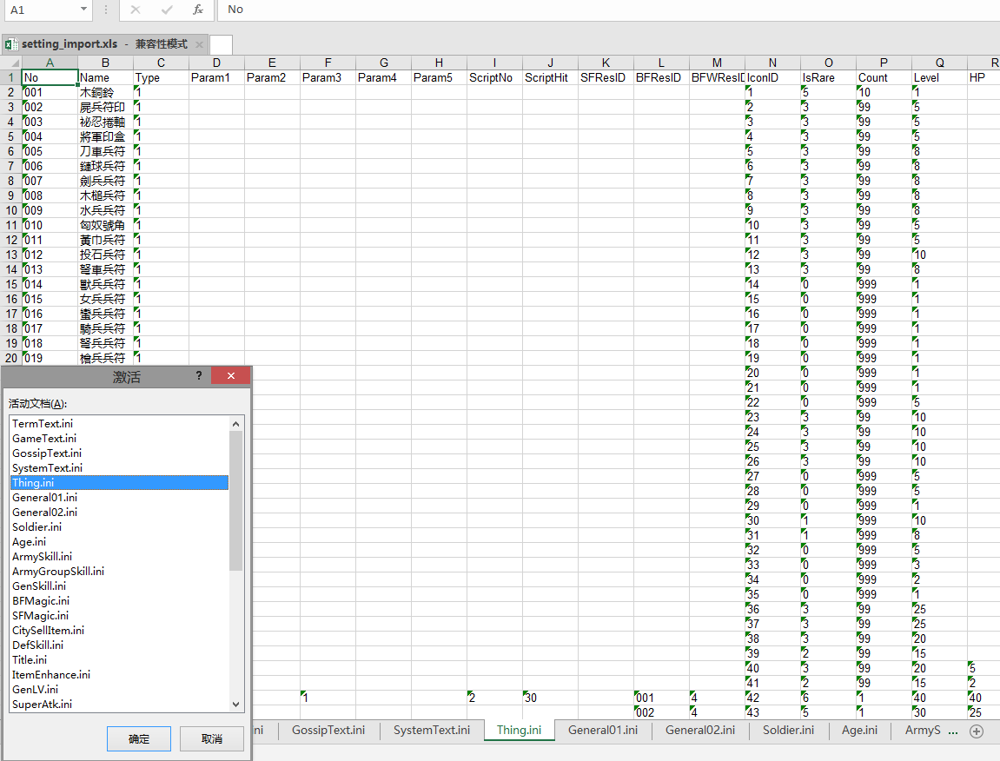

# sg-setting-excel

#### 介绍
三国群英传7配置文件转excel, excel导出生成配置文件。

#### 使用说明

1. 请先安装java8环境才能运行，请百度安装。https://www.cr173.com/soft/61157.html
2. dist目录是已经编译好的文件，直接双击run.bat运行，或者在命令行中使用命令：java -jar sg-setting-excel.jar运行
3. 运行后使用命令：
	1. import-file 将配置文件导入到excel,生成setting_import.xls文件
	2. export-file 从excel中导出配置文件,生成在setting_export目录

